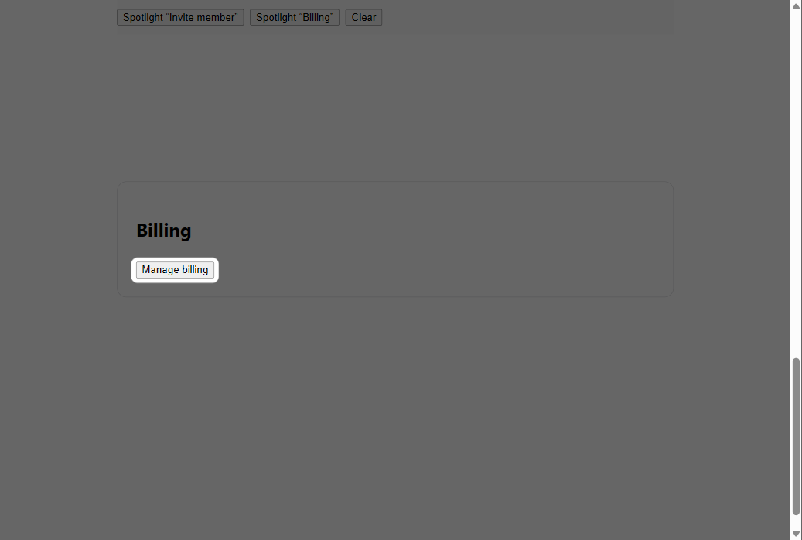
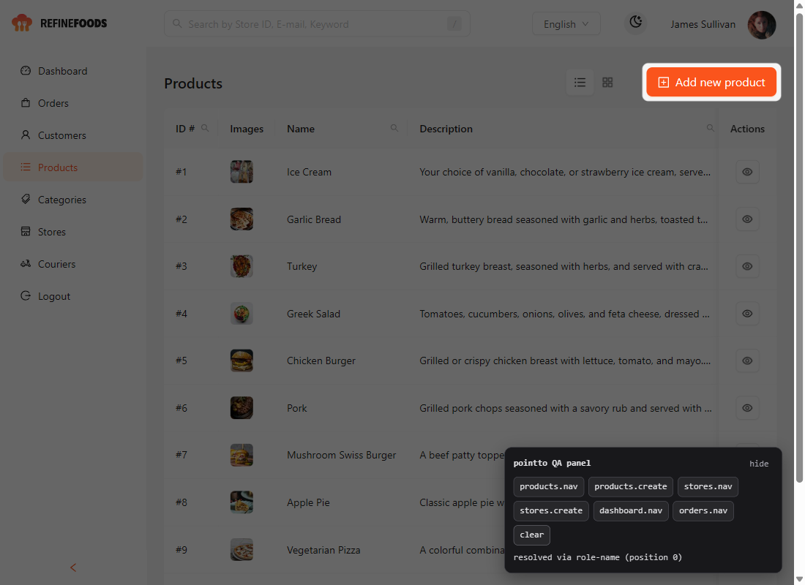
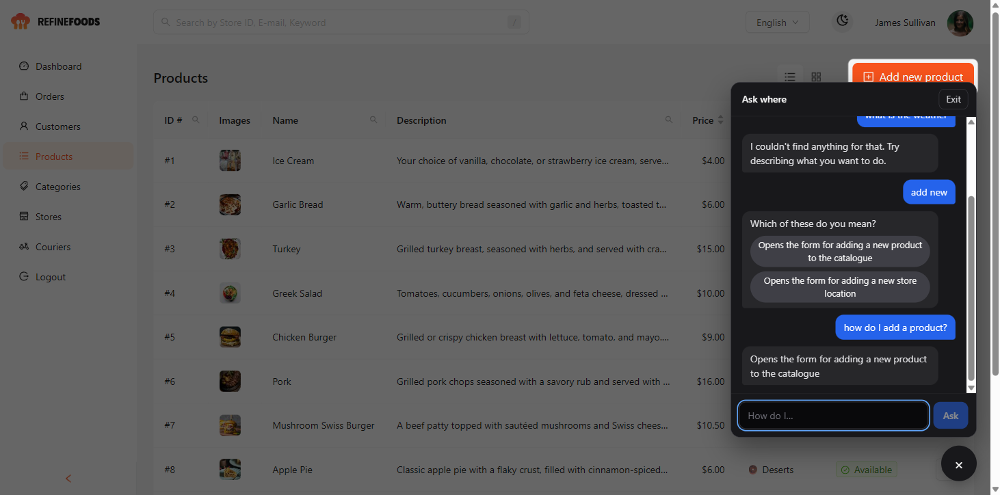
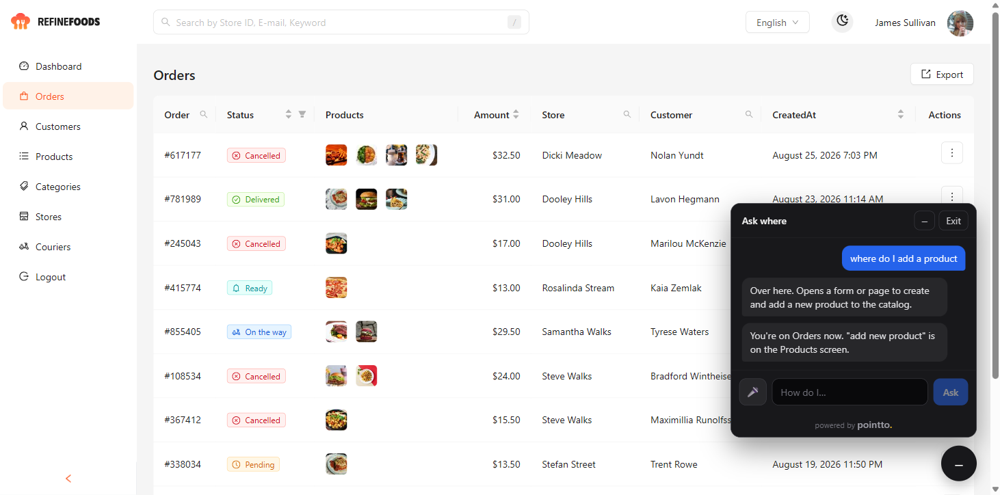

# pointto — QA manual

This document is written for a tester. You do not need to have read the build spec, and you do not need to understand the code. Each checkpoint is a list of things to do and what should happen when you do them.

A new section is added every time a development checkpoint is finished. Work through the newest section, and re-run the older ones if you have time — anything that used to pass and now fails is worth reporting immediately.

**How to report a problem:** say which numbered check failed, what you saw instead, your browser and OS, and your screen size. A screenshot or screen recording is worth a lot.

---

## Setting up, once

You need [Node.js](https://nodejs.org) version 20 or newer, and an internet connection.

```bash
git clone https://github.com/KoiGi01/meridian-cc_hackaton.git
cd meridian-cc_hackaton

node -v                 # must print v20 or higher
npm install -g pnpm     # only if `pnpm -v` fails
pnpm install            # takes about 30 seconds
```

Verified on a clean clone: `pnpm install` then `pnpm test` gives 174 passing tests.

To start the test page:

```bash
pnpm --filter playground dev
```

Then open **http://localhost:5173** in your browser. Leave that command running while you test; press `Ctrl+C` in the terminal to stop it.

To run the automated tests:

```bash
pnpm test
```

Everything should say passed. As of Checkpoint 6 there are 254 automated tests.

To start the **real third-party demo app** (added in Checkpoint 2):

```bash
pnpm --filter finefoods-antd dev:pointto
```

Then open **http://localhost:5190**. The first run takes longer, because it builds our library first.

Two things that will otherwise waste your time:

- Use `dev:pointto`, **not** `dev`. The app's own `dev` script prints a banner and then hangs forever on Windows. That is upstream's script, not ours.
- This app pulls live data from a public API that Refine hosts. **No internet, no data** — you will get a working page with empty tables.

---

## Checkpoint 1 — The spotlight

**Finished:** 2026-09-11

**What was built.** The basic mechanism the whole product rests on: making one element on screen light up while everything else dims. There is no voice yet, no question box, and no understanding of what the app does. The two "Spotlight" buttons at the top of the test page stand in for what the voice agent will eventually decide on its own.

**What you are really testing.** Two promises. First, the light lands exactly on the right element and stays there no matter how the page moves. Second, and more important, **the dimming never stops you from using the rest of the page.** That second one is a deliberate product decision, not an oversight: this library runs inside other companies' apps, and it must never trap someone in their own tool. If you ever find something you cannot click while the screen is dimmed, that is a serious bug — report it.



### Checks

| # | What to do | What should happen | Pass / Fail |
|---|---|---|---|
| 1.1 | Open http://localhost:5173 | The page loads with a heading "pointto playground" and three buttons near the top. Nothing is dimmed yet. | |
| 1.2 | Click **Spotlight "Invite member"** | The page scrolls down on its own to the Team settings box, the whole screen dims, and the "Invite member" button stays bright with a soft rounded outline around it. | |
| 1.3 | While it is lit, scroll up and down slowly with your mouse wheel | The bright patch stays stuck to the button the entire time. It must not lag behind, drift off to one side, or leave a trail. | |
| 1.4 | Resize the browser window, making it clearly narrower and shorter | The bright patch follows the button to its new position. It must not stay behind where the button used to be. | |
| 1.5 | With the screen dimmed, scroll to "Proof the host UI stays clickable" and click **Click me while dimmed** several times | The counter goes up every single time. **This is the most important check in this list.** If clicks are being swallowed, stop and report it. | |
| 1.6 | While something is lit, click **Spotlight "Billing"** | The page scrolls to the Billing box and the light moves smoothly to the "Manage billing" button. Only ever one thing is lit at a time. | |
| 1.7 | Click **Clear** | The dimming disappears completely and the page looks totally normal again. | |
| 1.8 | Turn on "reduce motion" in your system settings (Windows: Settings → Accessibility → Visual effects → Animation effects off; Mac: System Settings → Accessibility → Display → Reduce motion). Reload the page and switch between the two spotlight buttons | The light jumps straight to the new button with no sliding animation. Everything else behaves the same. | |
| 1.9 | Make the browser window very small, then spotlight something near the edge of the screen | The bright patch stops at the edge of the window. It must never be drawn partly outside the visible page or cause a scrollbar to appear. | |
| 1.10 | Try it in a second browser (Chrome, Firefox, Edge, Safari) | Everything above behaves the same way. | |

### Known and expected at this checkpoint

These are **not** bugs. They are things not built yet. Please do not file them.

- **Scrolling the lit element off screen makes the dimming disappear entirely.** By design, the tool would rather show you nothing than light up the wrong thing. Noticing that you wandered off and talking you back is a later checkpoint.
- There is no microphone, no voice, and no box to type a question into. The two Spotlight buttons are a stand-in for the agent.
- The tool has no idea what the page means. It cannot yet be asked "how do I invite someone" — it only lights up what it is told to.
- The test page is a plain harness we wrote. The real demo runs against a real third-party app and comes later.
- The browser tab shows a missing-icon warning in the developer console. Harmless, and it goes away when the demo app gets a favicon.

### Found during this checkpoint

One real bug, found by driving a real browser rather than trusting the automated tests: spotlighting anything below the fold lit up **nothing at all**, because the light was being clipped to the visible window and collapsed to zero size. The automated tests had missed it by pretending every element was already on screen. Fixed by scrolling the target into view first, and a test was added so it cannot come back silently. Check 1.2 is what guards it.

---

## Checkpoint 2 — Finding the right button, even after the app changes

**Finished:** 2026-09-11

**What was built.** Until now we told the tool *which element* to light by pointing straight at it. Now it is told only a name — `products.create` — and has to go find that thing on the page by itself.

It does that with a **cascade**. Each element in the manifest lists several different ways to recognise it, strongest first: a test id, then its role and label, then its exact text, then its position in the page structure. The tool tries them in order and takes the first one that matches exactly one thing on screen.

**What you are really testing.** That this survives the app changing underneath it. Real products get redesigned: buttons get renamed, attributes get dropped in refactors. A tour library that breaks when a label changes is worthless in practice. So the test page deliberately lets you sabotage the button and watch the tool find it anyway.

And the other half, which matters just as much: **when it genuinely cannot find something, it must light nothing and say so.** Lighting the wrong button is far worse than admitting failure. If you ever see it point at something that is not what you asked for, that is the most serious bug you can report.



### Part A — the rename-survival checks (test page, http://localhost:5173)

Run `pnpm --filter playground dev`. The black readout box shows how it found the element. Watch that box change as you sabotage things.

| # | What to do | What should happen | Pass / Fail |
|---|---|---|---|
| 2.1 | Click **Ask for "invite member"** | It scrolls to the Team settings box and lights the "Invite member" button. Readout says `anchor: testid`. | |
| 2.2 | Tick **remove its test id**, then click **Ask for "invite member"** again | The *same button* still lights up. Readout now says `anchor: role-name`. | |
| 2.3 | Also tick **rename the button** (it becomes "Add a teammate"), ask again | The same button *still* lights up, now labelled "Add a teammate". Readout says `anchor: css`. This is the headline result — the app changed twice and we never updated the manifest. | |
| 2.4 | Also tick **delete it entirely**, ask again | Readout says `not found` and lists what it tried. **Nothing is lit at all.** | |
| 2.5 | Untick everything and ask again | Back to `anchor: testid`. | |
| 2.6 | Ask for the same element twice in a row, scrolling away in between | It scrolls back to the element the second time. (It used to do nothing — see below.) | |
| 2.7 | Ask for "billing", then ask for "invite member" | The light moves. Only ever one thing is lit. | |

### Part B — the real third-party app (http://localhost:5190)

This is **Refine's open-source admin app**, which we did not write. We only mounted our widget into it. This is the part that shows this is a reusable library rather than a demo built to flatter itself.

A small dark **pointto QA panel** sits in the bottom-right. It is scaffolding for testing and will be replaced by the real voice widget later.

| # | What to do | What should happen | Pass / Fail |
|---|---|---|---|
| 2.8 | Open http://localhost:5190 and wait for the dashboard to load charts and a map | Real data appears. If it does not, check your internet — the data is fetched from Refine's public API. | |
| 2.9 | Click **products.create** in the QA panel | The orange "Add new product" button lights up, everything else dims. Readout: `resolved via role-name`. | |
| 2.10 | Click **products.nav**, **stores.nav**, **dashboard.nav**, **orders.nav** in turn | Each lights the matching item in the left sidebar. | |
| 2.11 | While something is lit, click around the app normally — open a product, change a page | Everything still works. The dim never blocks you. | |
| 2.12 | On the Products page, click **stores.create** | `not found`, and nothing lights up. Correct: that button only exists on the Stores page. | |
| 2.13 | Go to **Stores** in the sidebar, then click **stores.create** | Now it lights the "Add new store" button. | |
| 2.14 | Switch the app to dark mode (moon icon, top right), then spotlight something | Still works and is still readable. | |
| 2.15 | Switch the language dropdown to German, then spotlight **products.create** | **Expected to fail to find it.** See below — this is a known limitation, not a bug. | |

### Known and expected at this checkpoint

Please do not file these.

- **Changing the app's language breaks resolution** (check 2.15). Our anchors are written against the English labels, and translating the page changes them. The scanner and the manifest do not handle translated apps yet. Worth knowing, because the pitch talks about six-language support — that refers to the *user speaking* six languages, not the app's own UI being translated.
- **Still no voice and no microphone.** The QA panel is a stand-in. You still cannot ask a question in words — that is the next checkpoints.
- The QA panel is deliberately ugly. It is scaffolding, not product.
- The manifest is hand-written by us. The tool that generates it automatically comes later.
- The demo app depends on a public API that Refine hosts. If it is down, the app shows empty tables. Not our bug, but tell us if you see it often — it is a risk for judging day.
- The demo app prints some console warnings about React versions. Those come from the upstream app's own dependencies.

### Found during this checkpoint

**A bug the automated tests could not see.** Asking for an element that was *already* lit did nothing at all — no scroll, no re-point. The cause: the code only reacted when the target *changed*, and re-asking for the same button is not a change. This matters a lot, because "ask, wander off, ask again" is exactly what people do. Caught by driving a real browser; fixed; check 2.6 guards it now.

**A finding worth knowing.** The real Refine app has **no test ids anywhere**. Our schema treats test ids as the most reliable anchor, and a real application simply does not have them unless someone wrote end-to-end tests. Everything resolves through role-and-label instead — which worked for all six elements, at the strongest available level.

---

## Checkpoint 3 — Ask it in plain words

**Finished:** 2026-09-11

**What was built.** The widget. There is now a round **?** button in the bottom-right corner of both apps. Open it, type a question like *how do I add a product?*, and the app takes you to the right screen — changing page if it has to — and lights up the button you need. This is the first checkpoint where the whole product works end to end. There is still no voice; this text box is what voice will drive underneath, and it is also the fallback for anyone who denies the microphone or is in a noisy office.

**What you are really testing.** Three behaviours, in order of importance:

1. **It never lights the wrong thing.** If it does not understand you, it says so and nothing lights. If two things could match, it *asks* instead of guessing.
2. **It changes page for you when it needs to.** Ask about stores while you are on products, and you should end up on the stores page with the right button lit.
3. **You can always get out.** The Exit button is always visible, and Escape always closes it.



### The demo app (http://localhost:5190) — do this part first

The QA panel from Checkpoint 2 is gone; the real widget replaced it.

| # | What to do | What should happen | Pass / Fail |
|---|---|---|---|
| 3.1 | Go to **Products**. Click the **?** button bottom-right | A dark panel opens with a text box, an **Exit** button, and a short greeting. The text box has focus. | |
| 3.2 | Type **how do I add a product?** and press Enter | The orange "Add new product" button lights up. The widget replies with what that button does. You stay on the Products page. | |
| 3.3 | Still on Products, type **how do I add a store** | The page changes to **Stores** on its own, then "Add New Store" lights up. The reply starts with "Over here." | |
| 3.4 | Type **what is the weather** | Reply says it couldn't find anything. **Nothing is lit** — including anything that was lit before. | |
| 3.5 | Type **add new** | Reply says "Which of these do you mean?" with two clickable choices. Nothing is lit yet. | |
| 3.6 | Click one of the two choices | It navigates if needed and lights that button. | |
| 3.7 | Type **where are the orders** | The **Orders** item in the left sidebar lights up. | |
| 3.8 | Press **Escape** | The panel closes, the dimming disappears, the **?** button stays. | |
| 3.9 | Open it again and click **Exit** | Same as Escape. | |
| 3.10 | With something lit, click anywhere else in the app — open a product, sort a column | Everything still works. The widget never blocks you. | |
| 3.11 | Switch the app to **dark mode** (moon icon top right) and open the widget | The widget looks the same. The app's styling must not leak into it, or vice versa. | |
| 3.12 | Make the browser window narrow (phone-ish width) | The panel shrinks to fit and never goes off the edge. | |
| 3.13 | Type a question, then before it answers, press Escape | It closes cleanly with no error. | |

### The test page (http://localhost:5173)

The "Ask for" buttons from Checkpoint 2 are gone; use the widget. The break-the-manifest checkboxes still work.

| # | What to do | What should happen | Pass / Fail |
|---|---|---|---|
| 3.14 | Open the widget, type **how do I invite someone?** | Scrolls to Team settings, lights "Invite member". Readout says `anchor: testid`. | |
| 3.15 | Tick **rename the button**, ask again | Same button lights, now labelled "Add a teammate". Readout says `anchor: css` — the label changed, so it fell through to the position-based anchor. | |
| 3.16 | Type **where is billing?** | Scrolls to Billing and lights "Manage billing". | |

### Known and expected at this checkpoint

- **English only.** The matcher understands English phrasing. *¿cómo agrego un producto?* will get "couldn't find anything." Multilingual understanding comes with the voice agent in the next checkpoint, which has a real language model behind it. This text matcher is deliberately simple: it works offline, with no API key, and it is the floor the product never drops below.
- **It matches words, not meaning.** *how do I add a product* works because "add" and "product" are in the manifest. *how do I put a new dish on the menu* works too ("menu" is an alias). But a phrasing nobody anticipated may miss. Report anything that feels like it *should* have worked — those become new aliases.
- **The widget panel can overlap a lit button** if the button is near the bottom-right corner. Cosmetic; on the list for the polish checkpoint.
- Still no microphone. The widget deliberately never asks for one — there is an automated test asserting it does not.

### Found during this checkpoint

**A stale light.** After a successful question, asking something unrelated made the widget say "I couldn't find anything" — while the *previous* button stayed lit. The words and the light disagreed, which is the one thing this product must never do. Caught in the browser, fixed, and check 3.4 guards it. This is the third time a real bug passed the unit tests and only appeared in a real browser, which is why every checkpoint gets driven by hand before it is called done.

---

## Checkpoint 4 — Voice

**Finished:** 2026-09-11

**What was built.** The microphone. There is now a **🎤** button next to the text box. Press it, say *"how do I add a store?"*, and the app changes page, lights the button, and a voice tells you what it is. Typing while voice is on goes through the same brain, so it understands how you phrase things rather than just matching words.

**What you are really testing.** Voice is the part nobody on the team could fully verify with automation — a headless browser has no microphone. The plumbing (token, connection, tool calls, playback) was proven end to end by typing to the live agent. **Actually talking to it is on you.** That makes this the most valuable QA pass so far.

Also: **the microphone must only ever open when you press 🎤.** Never on page load, never on opening the widget. There is an automated test for it, but check the browser's mic indicator with your own eyes.

### Setup for this checkpoint

You need one extra terminal running the token server. It needs the `.env` file with the AssemblyAI key — ask the project owner for it; it is never in the repo.

```bash
pnpm dev:server          # http://localhost:8787 — leave it running
```

Then start the demo app as before. Use **Chrome or Edge** for this checkpoint; Firefox and Safari should also work but are less tested.

| # | What to do | What should happen | Pass / Fail |
|---|---|---|---|
| 4.1 | Open the demo app. **Before touching anything**, look at the browser tab for a microphone indicator | There is none. The mic is off. | |
| 4.2 | Open the widget with **?**. Look again | Still no mic indicator. There is a 🎤 button next to the text box. | |
| 4.3 | Press 🎤 | The browser asks for microphone permission. Allow it. The status in the panel header goes Connecting → Ready → Listening, and a voice says hello. The mic indicator appears now, and only now. | |
| 4.4 | Say, out loud: **"How do I add a product?"** | You see your words appear in the transcript as you speak. The page goes to Products if it was not there, "Add new product" lights up, and the voice tells you what that button does — in one short sentence. | |
| 4.5 | Say: **"Where can I see the orders?"** | The Orders sidebar link lights, and it tells you. | |
| 4.6 | Say something it cannot map: **"What is the weather today?"** | It says it cannot help with that, or asks what you are looking for. **Nothing lights up.** | |
| 4.7 | While the voice is talking, start talking over it | It stops mid-sentence and listens to you. (This is barge-in.) | |
| 4.8 | With voice on, **type** "how do I add a store" instead of speaking | Same result as speaking it: page changes, button lights, voice replies. | |
| 4.9 | Press **■** (the mic button while live) | Voice stops, mic indicator disappears, the transcript stays. | |
| 4.10 | Press 🎤 again, then press **Escape** | Panel closes, voice stops, mic indicator disappears. | |
| 4.11 | Reload. Open the widget, press 🎤, and **deny** microphone permission | A line appears saying it cannot use your mic but you can keep typing. Type "how do I add a store" — it still works, with a spoken reply. | |
| 4.12 | Stop the token server (Ctrl+C in that terminal), reload, press 🎤 | A clear message that voice could not start. Text still works via the offline matcher. | |
| 4.13 | Use it for a few minutes normally | No stuck states. Replies come within a couple of seconds. No pops or gaps in the voice. | |

### Known and expected at this checkpoint

- **Verified by a person: none of the above yet.** Everything through 4.8 was proven by *typing* to the live agent; speaking into a real microphone has not been tested by anyone on the team. Report everything.
- **Answers are in English.** The agent is set up to answer in the language you speak, but that path is not tested. Please test in English only for now.
- **The status can stick on "Speaking"** if the browser never answers the mic permission prompt. Cosmetic.
- **It only knows what is in the manifest** — six elements on three screens. Asking about couriers or categories will get an honest "I can't find that."
- **Voice costs money.** Every session uses AssemblyAI credits. Don't leave it open for fun.
- **The token server only accepts requests from localhost:5173 and :5190.** If you run the app on a different port, voice will fail with a 403. That is intended.

### Found during this checkpoint

**The agent was answering the wrong question.** Sending typed text as a bare conversation message, the documented way, made the agent reply as if nothing had been asked — once it literally replied with a *sample* user question from its own catalog. Carrying the text inside the reply request fixed it every time. Documented in the code so nobody "simplifies" it back.

**The agent hedged instead of pointing.** First prompt made it call a "where am I?" tool before highlighting, then lose the thread. Reworded so highlighting is its unambiguous first move. Now: question in → one tool call → light → one sentence.

### Checkpoint 4, addendum — the orb, captions, and collapse

Added after the first real-microphone test (2026-09-11). The chat panel was blocking the view, and there was no visual sign that the agent was talking.

| # | What to do | What should happen | Pass / Fail |
|---|---|---|---|
| 4.14 | Press 🎤 and watch the round button while the greeting plays | It glows **amber and swells with the voice** — louder syllables, bigger glow. It is driven by the real audio, so it should look alive, not like a fixed pulse. | |
| 4.15 | Press **–** in the panel header (or click the round button) | The chat hides. **Voice stays on** — the mic indicator in the tab stays, and the button keeps a thin amber ring. | |
| 4.16 | With the chat hidden, say "How do I add a product?" | While *you* talk, the button pulses **blue**. When it answers, amber with the voice, and what it said appears as a **caption next to the button** for a few seconds, then fades. | |
| 4.17 | Click the caption, or the button | The chat comes back with the full conversation. | |
| 4.18 | Press **Exit** (or Escape) | Everything stops, including the mic. The tab's mic indicator disappears. | |
| 4.19 | Look at the bottom of the chat panel | "powered by pointto" with an amber dot. | |
| 4.20 | Turn on "reduce motion" in your OS and repeat 4.14 | No animation: a steady amber ring while it speaks, nothing more. | |

Voice was changed from `lola` to `anna` after the first test: the same English sentence took 18 s with `lola` and 8 s with `anna`, and `lola`'s English was hard to understand. The raw audio was checked outside the browser (`server/scripts/greeting-wav.ts` writes a WAV straight from the API) and sounded right, which is how the fault was pinned on the browser side.

---

## Checkpoint 5 — The scanner generates the manifest

**Finished:** 2026-09-11

**What was built.** Until now the manifest — the file that tells pointto what exists in the app — was written by hand. Now a command generates it: it opens the app in a hidden browser, reads each screen the way a screen reader would, and asks Gemini to describe every button and link in plain words. The demo app now runs on a *generated* manifest, not a hand-written one.

**What you are really testing.** That a developer with zero knowledge of pointto can point it at their app and get something usable — and that the output is honest: no invented descriptions, no test ids that don't exist, a readable file they can correct by hand.

### Setup

`GEMINI_API_KEY` must be in `.env` (ask the owner). The demo app must be running on port 5190.

```bash
pnpm build
node packages/cli/dist/index.js scan --config examples/demo-app/guide.config.json
```

Expect it to take **several minutes** — Gemini's free tier is slow and sometimes says "overloaded", which the tool retries. It writes `examples/demo-app/src/pointto.generated.manifest.json`.

| # | What to do | What should happen | Pass / Fail |
|---|---|---|---|
| 5.1 | Run the command above | It lists each route with a count of elements, says how many were "hoisted" (shared by every screen), then labels each route, then prints a summary. No red errors. | |
| 5.2 | Open the generated `.json` file | Readable. Every element has an `id` like `products.add-new-product`, a one-sentence `purpose`, a few `aliases`, and 2–3 `anchors`. **Zero** `testid` anchors — this app has none, and the tool must not invent them. | |
| 5.3 | Find `app.logout` in the file | Its purpose says it logs out; aliases include natural phrases like "sign out". It sits under the route with path `"*"` (Everywhere), not repeated on every screen. | |
| 5.4 | Count how many elements are on the `/categories` route | Zero or very few. That screen has no unique controls beyond the shared sidebar. | |
| 5.5 | Run again with `--no-llm` added, to a scratch output (edit `output` in a copy of the config) | Finishes in under a minute. Same elements, but every `purpose` is `null` and `aliases` are empty. This is the offline skeleton. | |
| 5.6 | Restart the demo app (`pnpm --filter finefoods-antd dev:pointto`), open the widget, ask **"how do I add a store?"** | Still works — the app is now running on the *generated* manifest. | |
| 5.7 | Ask **"how do I log out?"** | The Logout item in the sidebar lights up. That element came from the scanner, not from any hand-written file. | |
| 5.8 | Ask **"where do I search?"** | The search box at the top lights up. It has no visible label — it is named by its placeholder text — and the scanner found it anyway. | |
| 5.9 | Break the config: change `baseUrl` to a port where nothing runs, and run the scan | A clear error naming the URL, not a hang or a stack trace. | |
| 5.10 | Remove `GEMINI_API_KEY` from `.env` (temporarily) and run without `--no-llm` | A clear error saying the key is missing, before the browser even opens. Put the key back. | |

### Known and expected

- **Slow.** A full labeled scan of 7 routes takes several minutes on the free tier. Run once, commit the file, done — this is not something that runs at app startup.
- **Gemini says "overloaded" sometimes.** The tool retries with backoff. If a route still fails after retries, it gets `null` purposes and the summary says which route, so you can re-run.
- **Pagination and icon-only buttons are skipped on purpose.** "1", "2", "•••" and unnamed icon buttons are not things a user asks for by name.
- **Modals and dropdowns are not scanned.** Only what is on screen when the route loads. Controls inside a menu that has to be opened first are invisible to it (BUILD-SPEC §11 calls this out as a known hard part).
- **The hand-written manifest still exists** at `pointto.manifest.json` for comparison, but the app no longer uses it.

### Found during this checkpoint

**Every route after the first came back empty.** After the first navigation, Playwright prefixes element handles with the frame (`f1e26` instead of `e26`) and the parser only accepted the bare form. One regex, one regression test.

**The model name in my head was stale.** `gemini-2.5-flash` is no longer available to new keys; the API said so in plain words and pointed at `gemini-3.6-flash`. Verified live, not assumed.

**The search box was invisible to both scanner and runtime.** It has no label; browsers derive its name from the `placeholder`. Both sides now do the same.

**Free-tier 503s killed the whole scan.** Now retried with backoff, and a route that still fails degrades to skeleton labels instead of losing everything.

---

## Checkpoint 6 — It notices when you wander

**Finished:** 2026-09-14

**What was built.** Until now, once something was lit, pointto just waited. Now it watches what you do with the light. Click the lit control and the light goes out. Leave the screen it is on and the light goes out *immediately* and the guide says one short sentence about where you are and where the thing you asked for lives — out loud if voice is on, in the panel if not. Come back to that screen on your own and the light is waiting for you again, with nothing said. Ignore the correction twice and it stops correcting and offers to start over. Ask for something destructive (logging out) and it asks you first.

**What you are really testing.** The product's claim over tour libraries: a tour breaks the moment you go off script; this corrects you or adapts. Also the tone. It should feel like a colleague glancing over, not a form validator. Any correction that reads as scolding, or a light that comes on when you did not ask, is a bug.

### Setup

Same as Checkpoint 4: `pnpm dev:server` in one terminal, `pnpm --filter finefoods-antd dev:pointto` in another, http://localhost:5190 in Chrome or Edge.

### Text mode (mic off) — everything here works offline, no API key

| # | What to do | What should happen | Pass / Fail |
|---|---|---|---|
| 6.1 | Open the widget, type **where do I add a product** | Page goes to Products, **Add new product** lights. | |
| 6.2 | Click **Orders** in the sidebar | The light is off *before* the Orders page has even finished loading. A new line appears in the panel: *"You're on Orders now. "add new product" is on the Products screen."* One sentence. No "oops", no "wrong". | |
| 6.3 | Click **Products** in the sidebar | **Add new product** is lit again. Nothing new is said. | |
| 6.4 | Click the lit **Add new product** button | The light goes out. Nothing is said. The create form opens as normal — pointto never got in the way of the click. | |
| 6.5 | Ask again, then wander three times: Orders → Products → Customers → Products → Couriers | Correction after Orders, silent relight after Products, correction after Customers, silent relight, and after Couriers a *different* line ending in *"Want me to start over, or should I stop pointing?"* | |
| 6.6 | After 6.5, click Products once more, then Orders | Nothing lights up, nothing is said. It gave up, as promised. | |
| 6.7 | Type **log me out** | Nothing lights. The panel says it is marked as destructive and asks whether to show it anyway, with **Yes, show me** and **No** buttons. | |
| 6.8 | Press **No** | *"Okay, I'll leave it."* Still nothing lit. | |
| 6.9 | Type **log me out** again, press **Yes, show me** | **Logout** in the sidebar lights. It is only lit — nobody logged you out. | |
| 6.10 | Ask for **add a product**, then click the search box at the top, then a column header to sort the table | The light stays on through both — even though sorting re-renders the whole table underneath it. Using the app on the same screen is not wandering. | |
| 6.11 | Ask for **add a product**, then press the browser **Back** button | Treated like 6.2: light off, correction shown. | |

### Voice (mic on)

| # | What to do | What should happen | Pass / Fail |
|---|---|---|---|
| 6.12 | Press 🎤, say **"where do I add a product?"**, then click **Orders** | Light off at once. Within a couple of seconds the voice says one friendly sentence, something like *"You're on the orders page now — products is where you add one."* Most of the time it also lights the **Products** link in the sidebar to show you the way back. | |
| 6.13 | Click the lit **Products** link | You land on Products and **Add new product** is lit again — with nothing said. This is the moment the whole feature exists for. | |
| 6.14 | Click **Add new product** | Light off, silence. | |
| 6.15 | Repeat 6.5 by voice | Two spoken corrections, then an offer to start over or stop. Then silence. | |
| 6.16 | Say **"log me out"** | It asks whether you are sure. **Nothing lights.** | |
| 6.17 | Say **"yes"** | **Logout** lights, and it tells you what the button does. It must **not** say it has logged you out. | |
| 6.18 | While it is speaking a correction, talk over it | It stops. No correction is replayed later — you were talking, not wandering. | |
| 6.19 | Wander, then say something unrelated before the correction plays | Whatever it says, it should never say the correction *and* answer you at once. Corrections wait for the agent to be idle. | |



### Known and expected

- **The way back is the model's choice.** After a correction the agent *may* light the sidebar link to the goal's screen. It usually does; it is allowed not to. It must never navigate you back itself.
- **A pending goal expires after two minutes.** Wander, get corrected, go do something else for five minutes, then visit Products — nothing lights. That is on purpose: an old goal must not come back as a surprise.
- **"Lost" is real but rare in this app.** If the lit control disappears from the screen without a route change (a closed drawer, a collapsed menu), the light goes out and a correction says it can no longer see it. The demo app has no easy way to trigger this; it is covered by automated tests.
- **The demo's Logout is flagged destructive by hand** in the generated manifest. The scanner now flags logout/sign-out on its own; rescanning would take ten minutes to produce the same file.
- **Test in English only.**

### Found during this checkpoint

**Voice sessions ended on their own twice, mid-correction, in the automated browser** — which has no real microphone. Once the panel also collapsed a few seconds later. Both were caught by instrumentation, neither reproduced in the instrumented run, and a later session ran four corrections cleanly. The fake microphone in that browser also produced phantom Spanish transcripts. If the session dies on you with a **real** mic, that is the bug to report: note whether the panel collapsed and whether a correction was in flight.

**The agent claimed to have logged the user out.** After lighting Logout on request it said "You have been logged out." The prompt now says highlight only lights the control and the user still has to click it.

**Two test-only traps in the DOM watcher.** The click listener runs in the capture phase, before the app's router changes the URL, so the outcome is read on the next animation frame. Tests that stub `requestAnimationFrame` synchronously saw the wrong answer, and a scheduling flag stored in the frame handle broke under the same stub. Both fixed in the watcher, not the tests.
